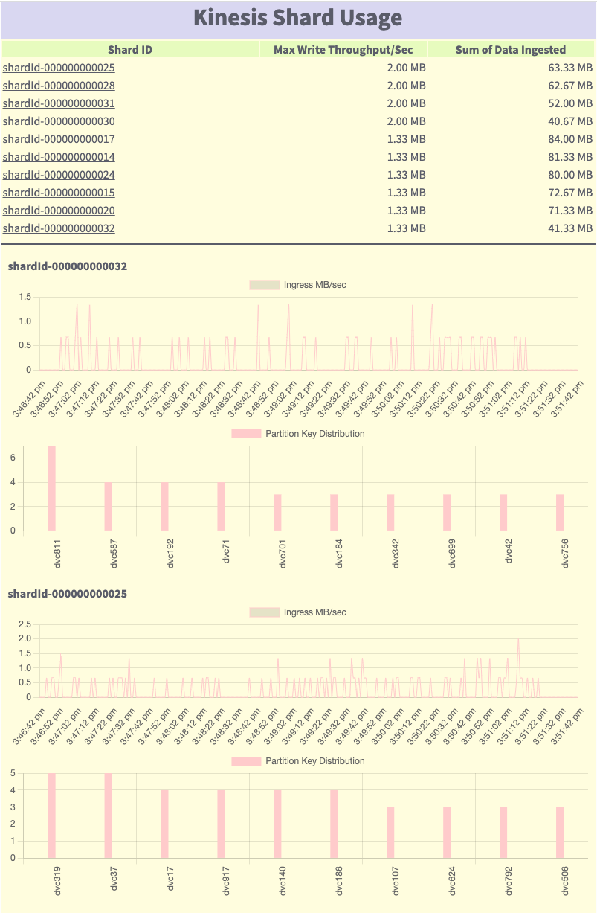

# Amazon Kinesis hot shard advisor
Easily identify hot shard and hot key on your Kinesis data streams.

## About
The Amazon Kinesis hot key advisor is a tool that simplifies identifying whether you have hot key or hot shard issues on your Kinesis data streams. The tool can also identify whether you are hitting the shard level throughput limit per-second basis.

## Prerequisite
1. Install [AWSCli](https://aws.amazon.com/cli/)
2. Configure [AWSCli](https://docs.aws.amazon.com/cli/latest/userguide/cli-configure-quickstart.html) specifying an AWS region. Use access key and secret key associated with an IAM user which has at least "**AmazonKinesisReadOnlyAccess**" policy attached.

Example:
```
C:\Users\UserName>aws configure
AWS Access Key ID [*****************]: ABCDXYZ
AWS Secret Access Key [****************]: ABCDXYZ
Default region name [None]: ap-southeast-2
Default output format [None]:

```

** Kinesis hotkey advisor will use the AWSCli configuration to access Kinesis data streams on a particular AWS region.

## Gettng started
1. Download the GitHub project on your local machine.
2. Use commandline and navigate to project directory that you have downloaded earlier.
3. run the below command
```
go run . -stream=[YOUR STREAM NAME]] -from="yyyy-mm-dd hh:mm" -to="yyyy-mm-dd hh:mm"
```
Example:  *go run . -stream=lab3 -from="2022-02-24 10:07" -to="2022-02-24 10:09"* 

## Output sample
```
Listing shards for stream lab3...OK!
 10 / 10 [====================================================] 100.00% 2m52s
output is written to out.html
```

## View the report
Once you see the output as above, open the **out.html** file from your current directory with your default browser to view the report.

## Sample report


## Contributing to the project
If you are interested in contributing to this project, here are the steps you can follow:
1. Install [Go](https://go.dev/doc/install) on your local computer
2. Clone this project, start developing and submit a pull request 